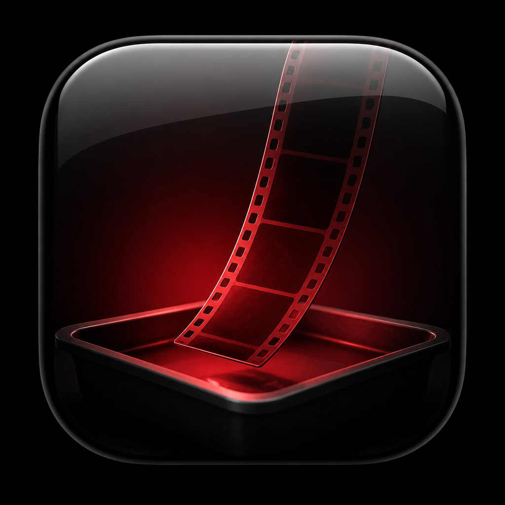

<p align="center"></p>

# filmify

**The feel of film, without the film camera.**

> **[⬇ Download filmify](https://github.com/siliconight/filmify/archive/refs/heads/master.zip)** — unzip, then double-click **START-HERE-WINDOWS.bat** or **START-HERE-MAC.command**. A file picker appears; pick a clip and the control panel opens. That's the whole install.

filmify is a lightweight, single-file tool for indie filmmakers. It makes
what you shot better — it doesn't replace your taste. You still pick the
final stock LUT, and you still edit the film. filmify is the darkroom: it
develops your footage with the things that make film read as *cinema*: protected highlights that roll off instead of clipping, 24 fps
motion with a 180° shutter feel, gentle softness, restrained color, halation
glow around bright lights, and organic grain. No NLE, no plugins, no
subscription — just Python and FFmpeg.

## Your first five minutes

**Easiest start (no terminal needed):** double-click the START-HERE file
for your OS. A native file picker appears — pick a clip and the control
panel opens; pick a folder (Cancel on the file picker first) and the whole
shoot gets a batch split-screen preview.

- **Windows** — for the smoothest experience, double-click
  **`Make filmify app.bat`** once. It puts a **filmify** icon on your
  Desktop and in the Start menu (pin it to the taskbar if you like) — click
  it any time, no console window, opens straight to the panel. The first
  run of any downloaded file may show SmartScreen ("Windows protected your
  PC") — click **More info → Run anyway**, once. *(Setup — Python, FFmpeg —
  is handled automatically the first time; FFmpeg is downloaded from
  gyan.dev, the build ffmpeg.org links to, and kept next to the app,
  nothing system-wide.)*

  Prefer not to make a shortcut? `START-HERE-WINDOWS.bat` works the same
  way on a double-click.
- **Mac** — for the smoothest experience, **right-click**
  `make-mac-app.command` → **Open** → **Open** once. It builds a real
  **filmify app** in the folder that you double-click like any other
  program from then on (drag it to your Dock if you like) — no Terminal,
  no right-click ever again. Setup (Python, FFmpeg) is handled through
  normal Mac dialogs the first time you open it. *(That one right-click is
  unavoidable for any free unsigned app; building the app locally is what
  lets every launch after it be a clean double-click.)*

  When the app finishes building it offers to move itself into your
  **Applications** folder — say yes and filmify lives with your other apps
  (Launchpad, Spotlight, Dock), opening with a normal double-click. The app
  remembers where its files are, so it keeps working from Applications.

  Prefer not to build an app? `START-HERE-MAC.command` still works the same
  way — right-click → Open the first time.

  Setup steps happen once; after that it's double-click → pick → done.

Either way you get a fast split-screen preview — your footage on the left,
the film look on the right — and a report opens in your browser.

**Don't have Python?**
- Windows: install from [python.org/downloads](https://www.python.org/downloads/)
  and tick **"Add python.exe to PATH"** during install. (Heads-up: typing
  `python` without it installed opens the Microsoft Store — use the
  installer from python.org instead.)
- Mac: `brew install python3`, or the python.org installer. The command is
  `python3` on Mac, `python` on Windows.

**From the terminal**, this is the command to try first:

```sh
python filmify.py yourclip.mp4 --compare --preview
```

Running `python filmify.py` with nothing else prints this quickstart.

## Requirements

- Python 3.8+
- [FFmpeg](https://ffmpeg.org) (`ffmpeg` and `ffprobe`)

Works on Windows, macOS, and Linux. Installing FFmpeg:

```sh
# Windows
winget install ffmpeg
# ...or just drop ffmpeg.exe and ffprobe.exe next to filmify.py

# macOS
brew install ffmpeg

# Linux (Debian/Ubuntu)
sudo apt install ffmpeg
```

filmify finds ffmpeg on your PATH, next to the script, or in the current
folder — whichever comes first.

## Quick start

```sh
python filmify.py myfootage.mp4
```

That's it — you get `myfootage_film.mp4` with the standard look.

Shot on a phone at 60 fps? Conform it to 24 fps with proper motion blur:

```sh
python filmify.py myfootage.mp4 --conform
```

Got a film-stock LUT and a scanned grain plate? Use the real thing:

```sh
python filmify.py myfootage.mp4 --lut kodak_print.cube --grain-plate 35mm_grain.mp4
```

Dialing in a look? `--compare --preview` renders a fast 5-second
split-screen — original on the left, graded on the right:

```sh
python filmify.py myfootage.mp4 --look heavy --weave 1.5 --compare --preview
```

Happy with it? Run the whole shoot day in one go (outputs land in
`shoot_day1/filmified/`; reruns skip already-processed files):

```sh
python filmify.py shoot_day1/ --look heavy --weave 1.5 --conform
```

## Shooting log? Develop it first

If your camera records S-Log3, V-Log, C-Log, Apple Log, or D-Log, tell
filmify so the look lands on properly developed footage instead of the flat
gray log image:

```sh
python filmify.py clip.mp4 --input-log slog3          # Sony
python filmify.py clip.mp4 --input-log vlog           # Panasonic
python filmify.py clip.mp4 --input-log clog3_to_709.cube   # any maker's official LUT
```

`slog3` and `vlog` use the manufacturers' published formulas with a soft
highlight shoulder; for other cameras, download the maker's free
log-to-Rec.709 .cube and point `--input-log` at it. Pair with `--depth 10`
and `--codec prores` to keep all that captured range through the pipeline:
10-bit processing avoids banding in skies and soft light, and DNxHR
automatically switches to its 10-bit HQX profile. An occasional vintage
light leak is there when you want it: `--leak`.

## The prestige pass

```sh
python filmify.py shoot_day1/ --match --print-stock neutral --depth 10 --codec prores
```

- `--print-stock neutral|warm|cool` — a built-in subtractive print-film
  color engine: density S-curves plus interlayer crosstalk, the
  cross-channel behavior colorists chase by grading digital through print
  emulations. It replaces filmify's built-in curve and split tone; your own
  `--lut` still wins, per the house rule: the final stock is your pick.
- Grain has physical scale: 16mm is visibly coarse, 70mm is near-invisible
  fine texture at the same strength, and grain lives in the midtones the
  way it does on negative — highlights stay clean.
- `--match` measures every clip in a batch and gently nudges each toward
  the batch median exposure and white balance before the look — so mixed
  cameras come out at the same level, not just the same look.

## Styles: one word, whole recipe

```sh
python filmify.py clip.mp4 --style blockbuster   # neutral print stock + Scope + 10-bit
python filmify.py clip.mp4 --style western       # warm stock + Scope + heavy
python filmify.py clip.mp4 --style horror        # cool stock, desaturated
python filmify.py clip.mp4 --style wedding       # warm stock, soft
python filmify.py clip.mp4 --style documentary   # heavy + 16mm grit
python filmify.py clip.mp4 --style noir          # heavy + B&W
python filmify.py clip.mp4 --style newsreel      # B&W 16mm, 4:3, weave
python filmify.py clip.mp4 --style super8        # 16mm, 4:3, leaks + weave
python filmify.py clip.mp4 --style anamorphic    # Scope + streak flare + 10-bit
python filmify.py clip.mp4 --style home-movie    # light leaks + gate weave
python filmify.py clip.mp4 --style epic          # 70mm + 2.2:1 + 10-bit ProRes
```

In the control panel (`--ui` or drag a clip onto the launcher), styles are
a gallery: a strip of cards, each one showing *your clip* rendered with
that style — click the one that looks right, then fine-tune.

Every output file carries proof of processing in its metadata
(`comment: processed with filmify <version> | <settings>`) — visible in
VLC, MediaInfo, or `ffprobe` — alongside the `_film` filename suffix and
the HTML report.

A style is just a flag set — every individual flag still overrides it, and
`--save-look` captures the expanded result.

## The control panel

```sh
python filmify.py clip.mp4 --ui
```

Opens a panel in your browser that works like an audio plugin: a slider for
every parameter, style presets, an A/B split preview that updates as you
drag (proxy-resolution renders — about a second even on 4K source), a scrub
bar, a load-a-saved-look dropdown, and Save Look / Render buttons. Runs
entirely on your machine (localhost), zero dependencies.

The drop launchers open this panel too: drop a clip onto or double-click
`START-HERE-WINDOWS.bat` / `START-HERE-MAC.command` and the panel appears —
no terminal at any point. Drop a folder instead and you get the batch
split-screen preview.

Shooting on a phone? HDR (HLG/PQ) sources are detected and tone-mapped to
Rec.709 automatically, so colors come out right instead of washed.
Re-running a batch only renders clips that don't have output yet
(`--force` redoes all).

## Format character: the gauge and the glass

```sh
python filmify.py clip.mp4 --ratio 2.39 --flare        # anamorphic Scope vibes
python filmify.py clip.mp4 --gauge 70mm --ratio 2.2    # large-format epic
python filmify.py clip.mp4 --gauge 16mm                # gritty documentary
```

- `--ratio` center-crops to a cinema aspect: **2.39** (modern Scope),
  **2.2** (70mm Todd-AO), **2.76** (Ultra Panavision), **1.85** (flat).
- `--gauge` sets the stock's physical character: 16mm is chunky and soft,
  70mm is fine-grained and clean — the negative is ~3.5x the area of 35mm,
  which is why epics shot on it look the way they do.
- `--flare` adds the anamorphic streak: bright lights grow a horizontal
  blue-tinted line.

What no post tool can fake: anamorphic oval bokeh and depth compression are
created by cylindrical glass at capture. A cheap anamorphic phone/lens
adapter gets you the real thing — and pairs beautifully with `--ratio 2.39
--flare`.

## Workflows

**1. Graded dailies** — shoot, batch-process, edit the graded clips.

```sh
# dial in the look on one clip, then save it as a project asset
python filmify.py clip01.mp4 --look heavy --weave 1.5 --compare --preview
python filmify.py clip01.mp4 --look heavy --weave 1.5 --conform --save-look myfilm.json

# run every shoot day through the same look, as edit-friendly ProRes
python filmify.py shoot_day1/ --look-file myfilm.json --codec prores
python filmify.py shoot_day2/ --look-file myfilm.json --codec prores
```

Mixed footage (a phone at 60 fps, a mirrorless at 30, drone clips in another
container) comes out as one uniform set: same 24 fps cadence, same codec,
same tonal character, same grain. That uniformity is most of what reads as
"one film" instead of "assembled clips." Use `--codec prores` (Final Cut,
Resolve, Premiere) or `--codec dnxhr` (Resolve, Premiere, Avid) here — they
scrub smoothly in editors and survive the editor's final export. The default
h264 is a *delivery* codec: editing it means your grain gets compressed
twice.

After every run, filmify writes **`filmify_report.html`** next to the
outputs and opens it in your browser: before/after thumbnails per clip,
✓/✗ status, fps in → out, sizes, and the exact settings used. It's a single
self-contained file — send it to a collaborator as "here's how day 2 came
out." `--no-report` to skip it.

**2. Finish pass** — edit the raw footage, export one master, filmify that.

```sh
python filmify.py master_export.mov --look-file myfilm.json
```

One generation of encoding instead of two, grain and weave run continuously
across cuts the way they would on a real print, and the look stays
adjustable until the very end. Best quality; the trade-off is editing
ungraded footage.

The look file is the cohesion mechanism in both: save it once, commit it to
your project folder, and every batch and the finish pass get identical
treatment. Relative LUT/grain-plate paths inside it resolve against the
look file's folder, so the project directory stays portable. Explicit flags
always override the file.

## Presets

| Preset     | Feel                                          |
|------------|-----------------------------------------------|
| `subtle`   | Barely-there. Modern digital cinema finish.    |
| `standard` | Clearly filmic without drawing attention.      |
| `heavy`    | Vintage stock — soft, grainy, faded blacks.    |

```sh
python filmify.py clip.mp4 --look heavy
```

Every component can be overridden individually: `--grain`, `--halation`,
`--soften`, `--saturation`, `--plate-opacity`, `--chroma-soften`, `--weave`,
`--bw`, `--preview`, `--no-curve`,
`--no-vignette`. Use `--dry-run` to print the FFmpeg command it builds
without running it.

## What the pipeline does (in order)

1. **24 fps / 180° shutter conform** (`--conform`) — blends adjacent frames
   from high-fps sources to synthesize natural motion blur, then drops to
   24 fps. This is the single biggest "video vs film" tell.
2. **Softening** — digital is too crisp; a gentle de-sharpen reads as glass.
3. **Gate weave** (`--weave`) — optional slow frame drift, like film moving
   through a projector gate. Layered sine motion, not random jitter.
4. **Filmic tone curve** — S-curve with a soft shoulder. Pure white lands
   below 100%, so highlights compress instead of blowing out. Blacks are
   lifted a hair, like a print.
5. **Film-stock LUT** (optional) — your `.cube` LUT supplies the color
   character; filmify steps out of the way and skips its own split tone.
6. **Color discipline** — mild desaturation, warm highlights, faintly cool
   shadows. Restrained on purpose; skin stays natural.
7. **Halation** — bright areas glow softly red-orange instead of clipping,
   the way light bounces inside a real film base.
8. **Grain** — a real scanned grain plate if you have one (looped and
   overlay-blended), otherwise synthesized temporal grain weighted to luma
   so it reads as silver grain, not sensor noise.
9. **Vignette** — slight corner falloff, like a lens.

Output is encoded with `x264 -tune grain` so the encoder doesn't smooth the
texture back out.

## What filmify can't do

It finishes the look — it can't recover what the camera threw away. The
biggest wins still happen on set:

- **Expose to protect highlights** (or shoot a log/flat profile and grade).
  Film forgives overexposure; digital does not. Once whites clip, no curve
  brings them back.
- **Light intentionally** — bad lighting reads as amateur faster than any
  camera choice, and over-lighting is the classic tell. Contrasty, stylish
  lighting usually means *fewer* fixtures: the sun, practicals already in
  the location, a lamp in frame. Free.
- **Shoot 24 fps with a 180° shutter in camera** when your rig allows it.
- **Adapt vintage glass.** A cheap adapted lens from the '70s gives you
  optical softness and character no filter or post process matches.
- **Spend on sound.** Audiences forgive soft images; they do not forgive
  bad audio. If you spend money anywhere, spend it there.
- **Shoot fewer, more deliberate takes.** Film's look came partly from its
  cost forcing intention. The discipline is free.
- **No colorist? Go B&W** (`--bw`). It reads as deliberate, not unfinished.

## Versioning

Releases follow SemVer and are tagged in git. See [CHANGELOG.md](CHANGELOG.md).

## License

Apache-2.0
